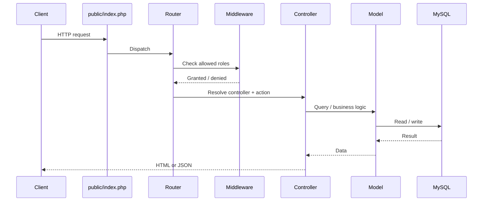

# FrameWork 🚀

### A lightweight PHP framework built from the ground up

**FrameWork** is a custom PHP framework project focused on understanding and implementing the core mechanisms behind modern web applications. It explores how HTTP requests can be mapped to controllers and actions through a structured routing system, with an emphasis on modularity, reflection, and PHP's native language features.

Rather than relying entirely on an existing framework, this project provides an opportunity to explore the engineering decisions that make a framework work internally.

## ✨ Key Features

* **Custom Routing System** — Organize incoming HTTP requests and map them to application controllers.
* **HTTP Method Handling** — Structure route handling around HTTP request methods.
* **Attribute-Based Routing** — Explore PHP attributes as a declarative way to associate route metadata with controller methods.
* **Reflection-Based Discovery** — Investigate PHP Reflection APIs to inspect classes, methods, and attributes at runtime.
* **Controller Mapping** — Separate controller discovery and route configuration from application entry-point logic.
* **Centralized Request Handling** — Use a single application entry point to initialize the framework and process requests.
* **Structured Error Handling** — Provide dedicated responses for common HTTP errors, including `403`, `404`, `405`, and `500`.
* **Modular Architecture** — Keep routing, mapping, and controller responsibilities organized into separate components.


## 🛠️ Technology Stack

* **PHP** — Core framework implementation
* **PHP Reflection API** — Runtime inspection of classes and methods
* **PHP Attributes** — Declarative route metadata
* **HTTP** — Request methods and status codes
* **JSON** — Potential configuration or mapping data, where implemented
* **Git** — Version control and development workflow

## 🏗️ Architecture

## Request Lifecycle




### Core Components

| Component   | Responsibility                                                     |
| ----------- | ------------------------------------------------------------------ |
| Entry Point | Bootstraps the application and initializes framework components.   |
| Router      | Resolves incoming requests to the appropriate application handler. |
| Mapping     | Organizes route and controller metadata for lookup.                |
| Controllers | Contain application-specific request-handling logic.               |
| Attributes  | Describe route metadata directly in PHP code, where supported.     |
| Error Pages | Present appropriate responses when requests cannot be fulfilled.   |

The exact responsibilities and request flow depend on the current implementation.

## 🚀 Getting Started

### Prerequisites

* PHP installed and available from your terminal
* PHP's built-in development server
* Git

Check your PHP installation:

```bash
php -v
```

### Installation

Clone the repository:

```bash
git clone https://github.com/ImeshVishmika/FrameWork.git
```

Navigate into the project:

```bash
cd FrameWork
```

Inspect the project structure and identify the application's entry point and configuration requirements.

The entry point is `index.php` and the project supports PHP's built-in development server, you can start it with:

```bash
php -S localhost:8000
```

Open http://localhost:8000 in your browser.

If the framework requires URL rewriting or a specific public document root, configure the server accordingly. The command above is a development example, not a guarantee that every route will work without additional configuration.

## 💡 Design Goals

This project explores several important backend engineering concepts:

* **Separation of concerns:** Keep routing, controller discovery, and application logic distinct.
* **Runtime introspection:** Use reflection to examine PHP classes and their metadata.
* **Declarative configuration:** Explore how attributes can make route definitions more closely associated with controller methods.
* **Maintainability:** Organize framework components so individual responsibilities can evolve independently.
* **HTTP correctness:** Distinguish between missing resources, unsupported methods, forbidden requests, and internal server errors.

## 🧪 Development and Testing

As the framework evolves, useful areas to test include:

* Valid and invalid URL paths
* Supported and unsupported HTTP methods
* Controller and action resolution
* Attribute discovery and reflection behavior
* Missing controller files or classes
* Correct HTTP status codes for error conditions
* Unexpected exceptions during request processing

These cases help validate not only whether a route works, but also whether the framework behaves predictably when something goes wrong.

## 🗺️ Roadmap

Potential areas for future development include:

* [ ] More comprehensive automated tests
* [ ] Route parameters and constraints
* [ ] Middleware support
* [ ] Request and response abstractions
* [ ] Dependency injection
* [ ] Improved exception handling and logging
* [ ] Configuration and environment management
* [ ] Composer-based autoloading and package distribution

This roadmap represents possible improvements rather than a commitment that these features are already available.

## 🎯 What This Project Demonstrates

FrameWork is an exploration of backend framework engineering, including the relationship between HTTP requests, routing, PHP reflection, metadata discovery, and controller execution.

Building these mechanisms directly provides a deeper understanding of the abstractions that established PHP frameworks provide and the trade-offs involved in designing reusable application infrastructure.

## 👨‍💻 Author

**Imesh Vishmika**

* GitHub: [@ImeshVishmika](https://github.com/ImeshVishmika)
* Repository: [FrameWork](https://github.com/ImeshVishmika/FrameWork)

---

*Built to explore the internals of PHP web frameworks and strengthen backend engineering fundamentals.*
